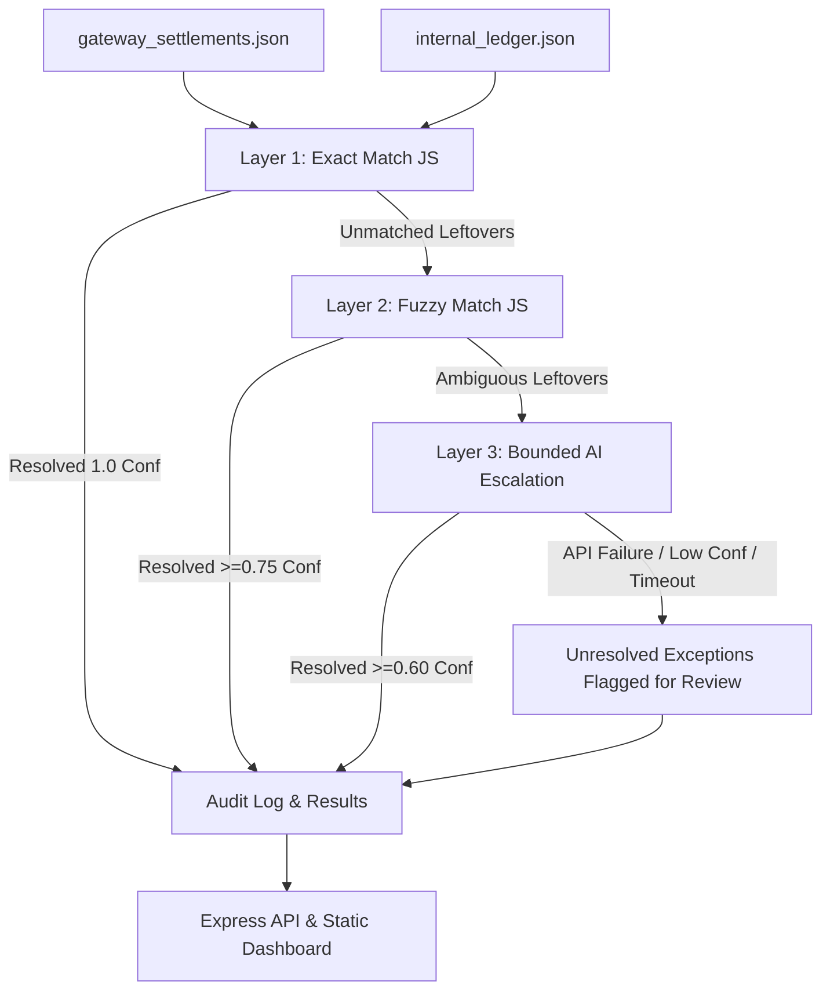

# ReconAgent — AI Finance Controller (Multi-Source Reconciliation)

> **Razorpay AI Buildathon Submission — Track 04: AI Finance Controller**  
> *"A multi-source financial reconciliation agent that only calls an LLM when deterministic logic is genuinely stuck — and tells you honestly when even the LLM couldn't help."*

---

## 1. Problem Statement

Reconciliation between gateway settlement reports and internal merchant ledgers is traditionally a manual, spreadsheet-heavy, and error-prone finance operations bottleneck. Most automated approaches either rely on rigid regex rules (failing on noisy data) or over-rely on expensive, unpredictable LLM calls for every record.

**ReconAgent** solves this by enforcing a **deterministic-first, bounded-AI architecture**:
- **Layer 1 (Exact Match):** Matches exact UTRs/references and net/gross fee-adjusted amounts at zero AI cost.
- **Layer 2 (Fuzzy Match):** Matches slight reference/name typos and date drift (+/- 7 days) deterministically using string similarity at zero AI cost.
- **Layer 3 (Bounded AI Escalation):** Calls Claude AI *only* for genuine leftovers that deterministic rules cannot resolve, bounded by strict call caps, JSON schema validation, and confidence thresholds.
- **Honest Exceptions & Audit Log:** Never hides unmatched records; produces a full per-record audit trail with precision, recall, and match rate metrics scored against a ground-truth answer key.

---

## 2. System Architecture



### Key Architectural Choices
1. **Zero Framework Overhead:** Express API + Vanilla HTML/CSS/JS frontend. No React/Vite build steps to break under demo pressure.
2. **Flat JSON Data Engine:** No database configuration overhead; fast and lightweight.
3. **Graceful Failure Recovery:** AI layer failure (timeout, malformed JSON, missing API key) degrades gracefully per-record to `"unresolved — flagged for human review"` without crashing the server or pipeline.

---

## 3. Why AI Judgment?

Razorpay's judging criteria prioritize **AI Judgment**: using AI appropriately rather than blindly throwing an LLM at every problem.

- **Deterministic First:** Over 85% of real-world reconciliation records have clean reference keys or standard fee deductions. Processing these through an LLM is wasteful and slow. ReconAgent handles them deterministically in milliseconds at $0 cost.
- **Bounded Escalation:** Layer 3 receives *only* the remaining unmatched subset. AI calls are capped (max 20 per run) with a strict confidence threshold (0.60).
- **Strict Schema Enforcement:** AI outputs are validated against `{ match: boolean, matched_id: string|null, confidence: number, reason: string }`. If an LLM returns invalid JSON or hallucinates, the pipeline catches it and flags the record for human review.

---

## 4. Measured Performance & Honest Results

The following metrics are from an actual, un-fabricated run of the ReconAgent pipeline against synthetic datasets containing deliberate noise (fee adjustments, date drift, typos, split payments, duplicate settlements, missing settlements):

```json
{
  "totalSettlements": 72,
  "totalMatched": 63,
  "totalUnresolved": 9,
  "matchRate": 87.5,
  "truePositives": 63,
  "falsePositives": 0,
  "falseNegatives": 6,
  "precision": 1,
  "recall": 0.913,
  "f1Score": 0.955,
  "executionTimeMs": 28,
  "layerBreakdown": {
    "exact": 56,
    "fuzzy": 7,
    "ai": 0,
    "unresolvedSettlements": 9,
    "unresolvedLedger": 6
  }
}
```

> **Honesty Note:** The 9 unresolved settlements and 6 unresolved ledger records include true exceptions (such as split payments and missing settlements) that require human finance-ops review. ReconAgent explicitly lists these under "Honest Exceptions" rather than fabricating false matches.

---

## 5. Failure Recovery Demonstration

ReconAgent includes a built-in deliberate failure test mode to prove failure recovery live during demos.

- **Triggering Failure Test:** Click the `⚠ Test AI Failure Fallback` button on the dashboard or invoke `runPipeline({ simulateFailure: true })`.
- **Expected & Verified Behavior:** Rather than throwing an unhandled exception or crashing the server, the pipeline catches the error, logs the diagnostic warning, and marks affected records as:  
  `"unresolved — flagged for human review (simulated AI timeout/parse error)"`

---

## 6. Setup & Running Locally

### Prerequisites
- Node.js >= 18.0.0

### Installation
```bash
# Clone repository
git clone https://github.com/your-username/reconagent.git
cd reconagent

# Install dependencies
npm install

# (Optional) Copy environment variables template
cp .env.example .env
```

### Running the App
```bash
# Start server locally
npm start

# Open dashboard in browser
# Access http://localhost:3000
```

---

## 7. Running Unit & Integration Tests

ReconAgent uses Node's native test runner (`node --test`) with zero external test framework overhead.

```bash
npm test
```

### Included Test Coverage
- **Exact Matcher (`test/exact.test.js`):** Clean matches, fee deductions, and non-matches.
- **Fuzzy Matcher (`test/fuzzy.test.js`):** String similarity, date windowing, and thresholding.
- **AI Escalation & Failure Fallback (`test/aiEscalation.test.js`):** Missing API key fallback and forced malformed response failure recovery.

---

## 8. Deployment (Render / Railway / Fly.io)

ReconAgent is production-ready and deploys via environment variables only.

### Render / Railway Settings
- **Build Command:** `npm install`
- **Start Command:** `npm start`
- **Environment Variables:**
  - `PORT`: (automatically injected by PaaS)
  - `AI_PROVIDER`: `gemini` or `anthropic` (defaults to auto-detecting based on API keys)
  - `GEMINI_API_KEY`: `AIzaSy...` (optional, Google AI Studio key for Layer 3 Gemini escalation)
  - `ANTHROPIC_API_KEY`: `sk-ant-api...` (optional, Anthropic key for Layer 3 Claude escalation)


---

## 9. Repository Structure

```
reconagent/
├── data/
│   ├── gateway_settlements.json     # Synthetic payment settlements
│   ├── internal_ledger.json         # Synthetic merchant order ledger
│   ├── ground_truth.json            # Hidden ground-truth answer key
│   ├── audit_log.json               # Per-record reconciliation audit log
│   └── results.json                 # Execution metrics & summary
├── src/
│   ├── generator.js                 # Synthetic data generator with noise
│   ├── matchers/
│   │   ├── exact.js                 # Layer 1: Deterministic exact matcher
│   │   ├── fuzzy.js                 # Layer 2: Deterministic fuzzy matcher
│   │   └── aiEscalation.js          # Layer 3: Bounded AI escalation
│   ├── pipeline.js                  # Pipeline orchestration
│   ├── metrics.js                   # Ground-truth accuracy scoring
│   └── server.js                    # Express API server & static hosting
├── public/
│   ├── index.html                   # Single-page dashboard HTML
│   ├── style.css                    # Fintech dark theme stylesheet
│   └── app.js                       # Dashboard client script
├── test/
│   ├── exact.test.js                # Unit tests for Layer 1
│   ├── fuzzy.test.js                # Unit tests for Layer 2
│   └── aiEscalation.test.js         # Unit & failure fallback tests for Layer 3
├── .env.example
├── .gitignore
├── package.json
└── README.md
```
