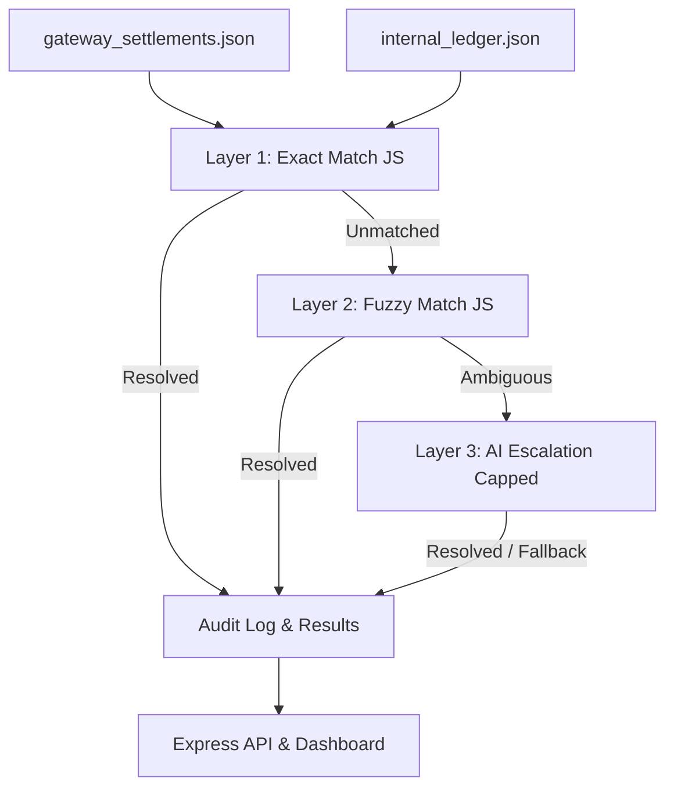

# ReconAgent — AI Finance Controller (Multi-Source Reconciliation)

> Razorpay AI Buildathon — Track 04: AI Finance Controller

## 1. Problem Statement
*TBD*

## 2. Architecture

## 3. Why AI Judgment?
*TBD*

## 4. Setup & Running Locally
*TBD*

## 5. Running Tests
*TBD*

## 6. Deployment (Render / Railway)
*TBD*

## 7. Measured Performance & Results
*TBD*
